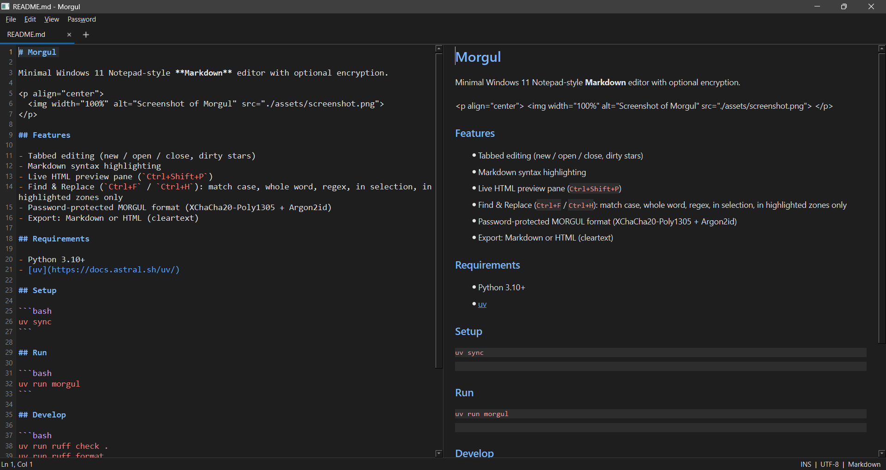

# Morgul

Minimal Windows 11 Notepad-style **Markdown** editor with optional encryption.

<p align="center">
  
</p>

## Features

- Tabbed editing (new / open / close, dirty stars)
- Markdown syntax highlighting
- Live HTML preview pane (`Ctrl+Shift+P`)
- Find & Replace (`Ctrl+F` / `Ctrl+H`): match case, whole word, regex, in selection, in highlighted zones only
- Password-protected MORGUL format (XChaCha20-Poly1305 + Argon2id)
- Export: Markdown or HTML (cleartext)

## Requirements

- Python 3.11+
- [uv](https://docs.astral.sh/uv/)

## Setup

```bash
uv sync
```

## Run

```bash
uv run morgul
uv run morgul <file>
```

Passing a single file path opens that file. If the file is already open in a tab, Morgul switches to it; otherwise it opens in a new tab.

## Develop

```bash
uv run ruff check .
uv run ruff format .
uv run ty check
uv run pytest
```

## License

**Unlicense** (public domain). Runtime GUI toolkit is **PySide6-Essentials** (LGPL-3.0). Markdown parsing is **markdown-it-py** (MIT). See [NOTICE.md](./NOTICE.md) for all dependencies.
